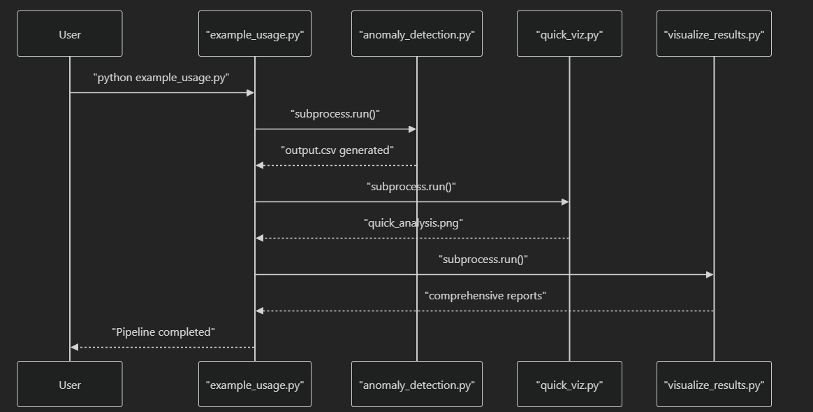

# Multivariate Time Series Anomaly Detection

## Overview

A batch-processing system for detecting anomalies in **industrial multivariate time series** using **IsolationForest** with feature attribution.
Supports **post-incident analysis** and **periodic monitoring** of complex processes.

---

## Features

* **Anomaly Detection** – IsolationForest with `n_estimators=200`, `contamination=0.1`.
* **Feature Attribution** – Top 7 contributing features per anomaly.
* **Score Calibration** – Raw scores mapped to 0–100 scale with validation constraints.
* **Time Window Validation** – Enforced training (2004-01-01 to 2004-01-05) and analysis (2004-01-01 to 2004-01-19).
* **Visualization** – Quick 2x2 dashboard and detailed 4x2 report.
* **Batch Orchestration** – End-to-end pipeline from CSV input to enhanced CSV output.

---

## System Architecture

* **Input Layer**: CSV with timestamp + numeric features
* **Core Processing** (`AnomalyPipeline`):

  * `_load_and_preprocess()`
  * `_split_data()`
  * `_train_model()`
  * `_detect_anomalies()`
  * `_calibrate_scores()`
  * `_calculate_feature_attributions()`
  * `_add_output_columns()`
* **ML Components**:

  * `StandardScaler` (normalization)
  * `IsolationForest` (anomaly detection)
* **Output Layer**: Enhanced CSV with `abnormality_score` + `top_feature_1..7`
* **Visualization**: `quick_viz.py` (dashboard), `visualize_results.py` (report)


---

## Validation Rules

* **Training Scores (2004-01-01 → 2004-01-05):**

  * Mean < 10
  * Max < 25
* **Score Buckets:**

  * Normal: 0–29
  * Moderate: 30–59
  * Significant: 60–89
  * Severe: 90–100

---

## Usage

### CLI

```bash
python anomaly_detection.py input.csv output.csv
```

### API

```python
from anomaly_pipeline import AnomalyPipeline

pipeline = AnomalyPipeline()
pipeline.run("input.csv", "output.csv")
```

---

## Output

* **Enhanced CSV**: original data + `abnormality_score` + top feature columns
* **Visuals**:

  * Quick view: `quick_viz.create_quick_analysis()`
  * Full report: `AnomalyVisualizer.create_comprehensive_report()`

---

## Repository Structure

```
anomaly_detection.py    # CLI entrypoint
anomaly_pipeline.py     # Core pipeline (data, model, scoring, attributions)
quick_viz.py            # Quick dashboard
visualize_results.py    # Comprehensive reporting
example_usage.py        # Example end-to-end run
```


